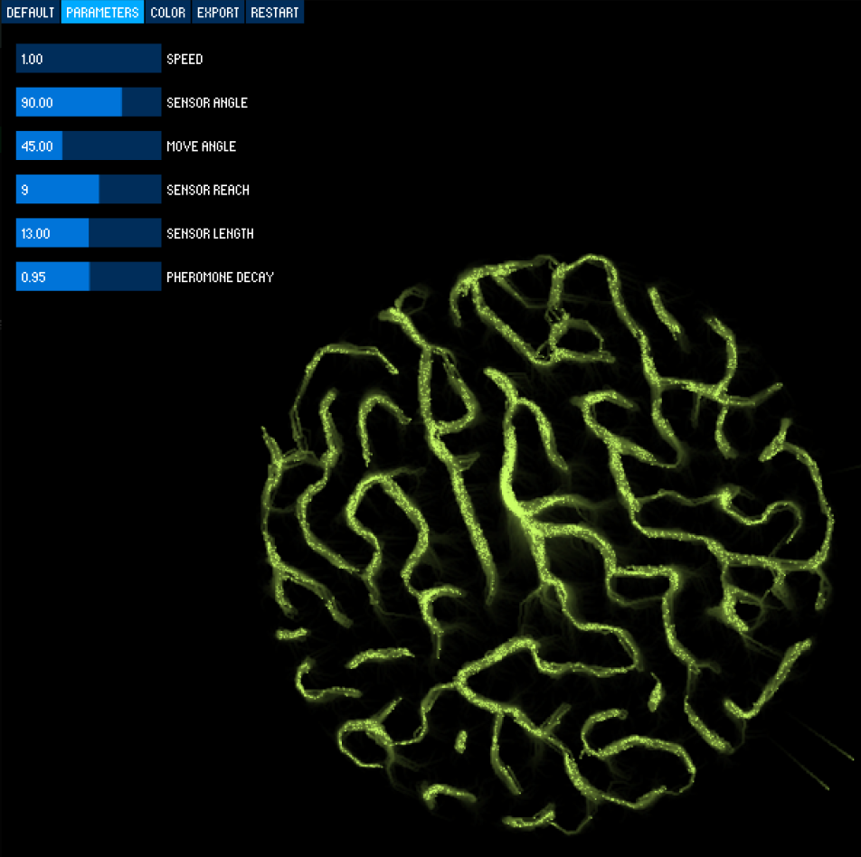
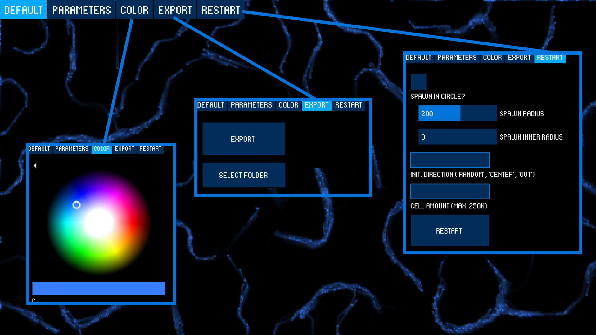
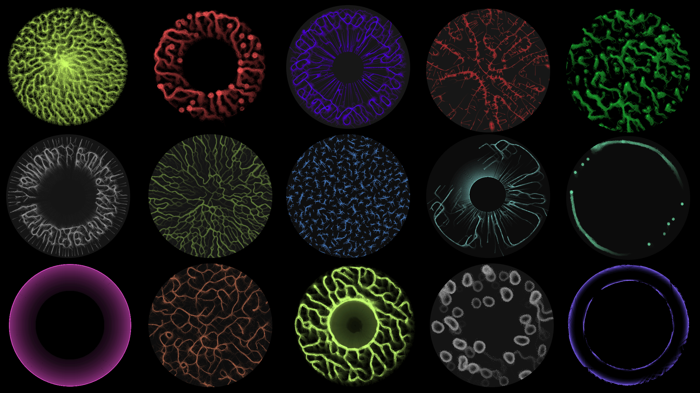

# A Physarum Slime Simulation in Processing

##### by Sissi Zhou and Theodor Peifer

### 🕹️ Usage:
##### Best option:
Install Processing from the [official website](https://processing.org/download) and paste in the code from [simulation.pde](./simulation.pde). Simply click run!

##### If you use Windows:
Download [windows-amd64.zip](./assets/windows-amd64.zip), extract it and execute ``simulation.exe`` (trust me...).

### 📽️ Slides:
To find out how it all works check out [this presention]().

### 👀 Preview:
Parameters             |  Other controls
:-------------------------:|:-------------------------:
  |  

### 🦠 Examples:
